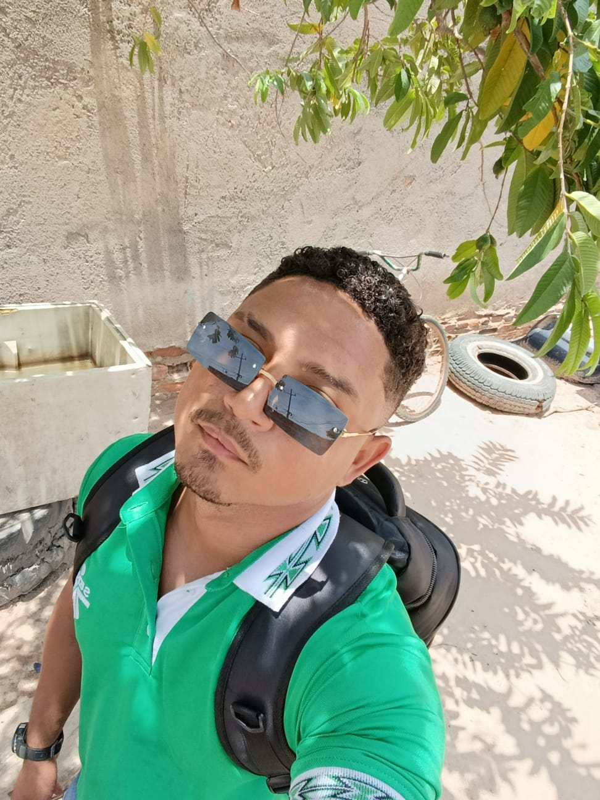

# Perfil de Usuario - Carlos Alberto Díaz Sánchez

Este proyecto consiste en una página web simple y estilizada que presenta el perfil personal de Carlos Alberto Díaz Sánchez. La página está construida con HTML y CSS, con un diseño limpio, responsivo y moderno.

## Estructura del Proyecto

- `index.html`: Documento principal que contiene el contenido del perfil.
- `styles.css`: Hoja de estilos que define el diseño visual de la página.
- `image/foto.jpeg`: Imagen de perfil utilizada en el encabezado (debes proporcionar esta imagen).
- Se incluye uso de íconos mediante Font Awesome (requiere conexión a internet).

## Contenido del Perfil

La página incluye:

- Encabezado: Foto de perfil y nombre completo.
- Sección "Sobre mí": Descripción breve del usuario.
- Sección "Intereses": Lista de intereses o aspiraciones profesionales.
- Pie de página: Datos de contacto y enlaces sociales (GitHub y correo electrónico).

## Tecnologías Utilizadas

- HTML5: Estructura del contenido.
- CSS3: Estilizado personalizado.
- Font Awesome: Íconos vectoriales escalables para mejorar la apariencia visual.

## Vista Previa

> Asegúrate de colocar tu propia imagen en la carpeta `image/` con el nombre `foto.jpeg`.

## Cómo Usar

1. Clona o descarga este repositorio.
2. Asegúrate de tener una imagen de perfil con el nombre `foto.jpeg` en la carpeta `image/`.
3. Abre `index.html` en tu navegador favorito.

## Contacto

Este perfil fue creado como parte de una práctica o portafolio personal. Puedes modificar el contenido según tus necesidades.

---
Desarrollado por Carlos Alberto Díaz Sánchez.
